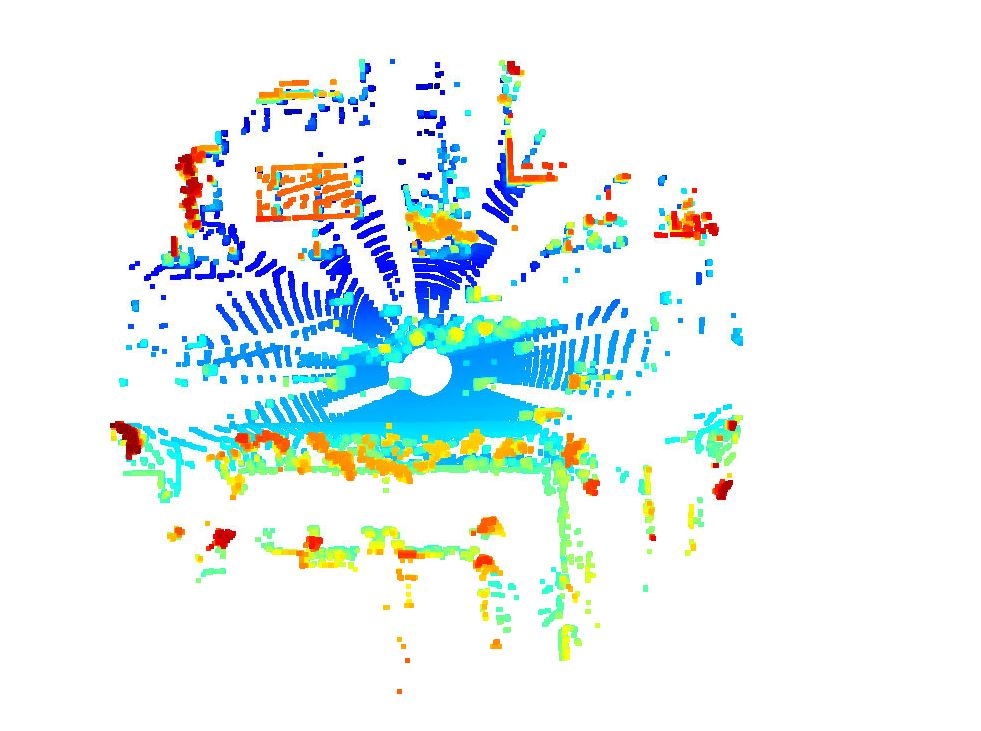

# Writeup: 3D-Objects Detection

## Midterm Write-up
This is a pre-setup project. Every single step has its own configurations. I have followed the instructions stricly and haved tested all exercises out successfully, so if you are going to review them in a different configuation, please be plexible. For example, in ID_SE3_EX2, line 231 in detect_object.py: detections = detections[0].get(1) # Unpack the actual detections, please be flexible with the Dictionary vs. Tensor when you are using fpn_resenet vs. darknet. See below images for the evidents. Anyways, I have added the flexibility to your code. But, in general, please be extremely flexibile with the code, configuarations, and pre-setup files.

### ID_S2_EX2:
#### Example 1

+ Heavy traffic. 
+ Multiple vehicles are moving from left to right
+ Hard to identify each individual, standard vehicle far way. 

#### Example 2

+ Same sequence as Example 1
+ Two vehicle in the middle can be separeted easier than Example 1
+ Red, Yellow, and Orange dots are moving into the road from the right. Unsure the representations of them.

#### Example 3

+ Same sequence as Example 1
+ Crowded space: hard to identify each individual object.

#### Example 4

+ Same sequence as Example 1. Angle of view is changed
+ Seems to have multiple pedestrians and cyclists on the sidewalk

#### Example 5

+ Same sequence as Example 1. 
+ There could be vehilces, pedestrians and cyclists. But hard to separate and identify individual ones.

#### Example 6

+ New sequence.
+ Multiple vehicles lining up near the bottom. Unsure about the red dots in the middle of the road.
+ The top may have pedestrians and cyclists.

#### Example 7

+ Same sequence as Example 6
+ Object obstacle limitting possible detection/scanning ability for the sections behind the two vehicles.
+ This could be a natural problem of lidar.

#### Example 8

+ Same sequence as Example 6. From another angle of view.
+ Seems like cyclists are in the middle of the road.

#### Example 9

+ New sequence.
+ The same Lidar limitation as in Example 7
+ Too crowded space: hard to identify and track objects, especially vehicles.

#### Example 10

+ Same sequence as Example 9. Another angle of view.
+ The same Lidar limitation as in Example 7
+ Too crowded space: hard to identify and track objects. Unsure if there are any vehiles or only cyclists.

### Please comment all the visualization (e.g., ID_S2_EX1/2/3) for observing the below statistics

